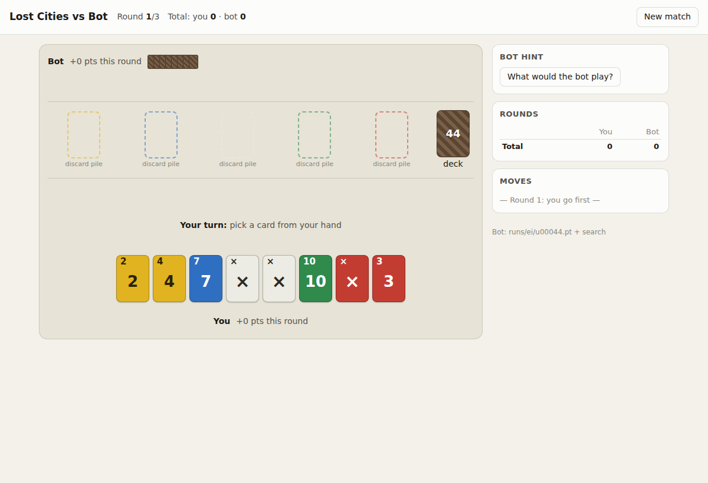
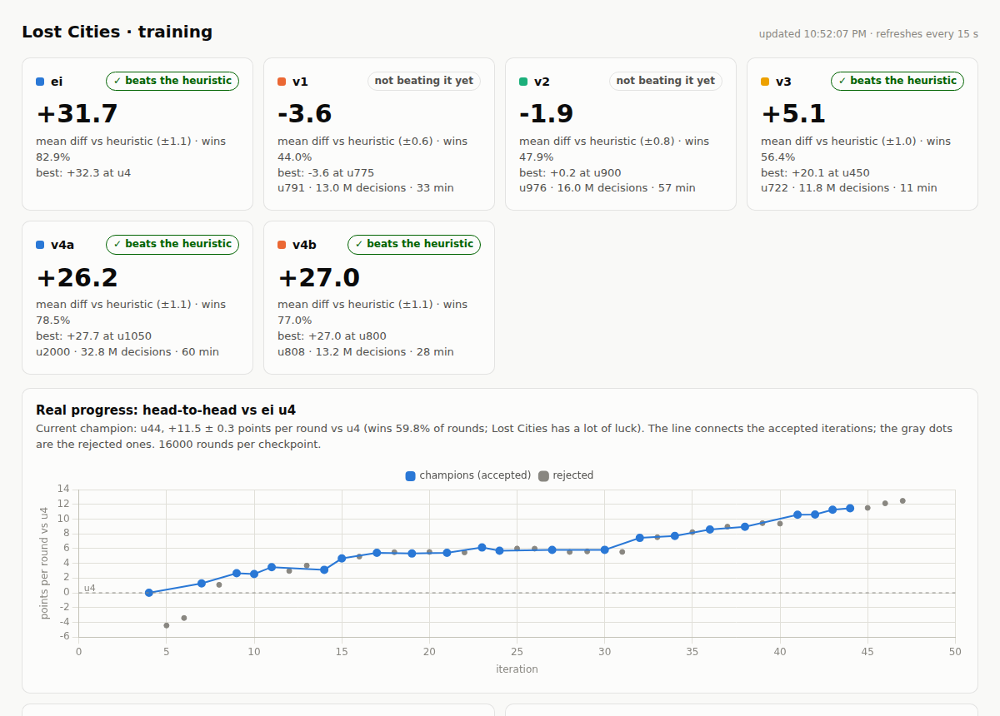

# Lost Cities AI

An engine and self-play-trained bots for **Lost Cities** (classic 2-player edition, 5 colors), plus a small web UI to play against the bot and a dashboard to follow training.

Everything runs locally: the game engine is pure Python, and the bot is a 0.8M-parameter MLP (3 MB) trained on a single RTX 3070.

**[▶ Play it in your browser](https://gnabcel.github.io/lost-cities-ai/web/)**: no install, the bot runs on your machine.
**[How it works, illustrated](https://gnabcel.github.io/lost-cities-ai/how-it-works/)**: what the bot sees, how the search teaches it, and the measurements behind each step.



## Results

| Bot | vs rule-based heuristic (per round) | vs `ei u4` head-to-head (per round) |
|---|---|---|
| Behaviour cloning of the heuristic | −5.8 | |
| PPO self-play (best, `v4a u1050`) | +27.7 | |
| Expert iteration `u4` | +32.3 (wins 82% of rounds) | 0 (reference) |
| **Expert iteration `u44` (shipped as `models/champion.pt`)** | +30.3 (wins 80% of rounds) | **+11.5** (wins 60% of rounds) |



Notes:
- Lost Cities is very luck-heavy, so even a large edge in points per round shows up as a modest round win rate. Over a 3-round match the edge compounds.
- The score against the heuristic is *not* a good strength metric for strong bots. Early bots learned to stall (drawing useless cards from the discard pile so the deck never runs out) because it farms points off a heuristic that never stalls. Later bots stall less and score slightly lower against the heuristic, but they are much stronger head-to-head. Progress is therefore measured head-to-head against a fixed reference network (`ei u4`).
- Against its author (a long-time Lost Cities player) `u44` + search won 3 of 4 matches.

## How it works

1. **Engine** (`engine.py`): full rules, a 126-action space (play/discard each card × draw source), an observation vector from one player's point of view, and *determinization* (resampling hidden cards consistently with what a player has seen).
2. **Bootstrapping**: a hand-written `HeuristicBot`, behaviour cloning of it, then **PPO** self-play (`ppo.py`). PPO plateaued around +27 vs the heuristic.
3. **Expert iteration** (`expert_iter.py`, AlphaZero-style but with a rollout search instead of MCTS):
   - **Teacher** (`search.py`, `RolloutSearchBot`): for the network's top-4 candidate moves, sample 64 determinizations of the hidden cards, play each candidate and finish the round with the network playing both sides, and average the final score difference. Same determinizations for all candidates (common random numbers).
   - **Prior**: a candidate's score is `mean + 2 · log π(a)`, so the search only overrides the network when the evidence beats the noise. Training target: `π(a) · exp(mean / 2)`.
   - **Student**: every iteration a *fresh* network is trained from scratch on the search targets of the last 12 iterations (~1.2M decisions), then its value head is refit as a linear probe.
   - **Gating**: the new network becomes champion only if it beats the current one by more than one standard error over 16,000 rounds (alternating seats and who starts).

### Lessons learned along the way

These were all measured, not guessed. Each one unblocked a plateau:

- **A noisy teacher is worse than the student.** With 16 determinizations and no prior, the search played *worse* than the raw network (−12.5 points/round), and two iterations in a row got worse. 64 determinizations plus the prior made it +10.
- **Distillation was too timid.** 3 epochs at lr 1e-4 barely moved the network; more epochs and more data (several iterations pooled) gave +1 to +2 per iteration.
- **The value head memorizes rounds.** Positions from the same round share the same outcome, so long training made the value head memorize outcomes (a random validation split doesn't catch it; fresh rounds do). Fix: train the policy only, then refit just the value layer.
- **Retraining from scratch beat fine-tuning.** Fine-tuning the champion on more data gave nothing; a fresh network trained on the same data was +1.6 better. A 3× bigger network didn't help.
- **Truncated rollouts need a good value head.** Cutting rollouts at 30 plies and bootstrapping with the value head was cheap and fine early on, but with from-scratch networks it weakened the teacher (+2.5 vs +6.9 with full rollouts).

## Quick start

Requires Python ≥ 3.10, PyTorch and NumPy (developed with Python 3.12, torch 2.x, CUDA optional).

```bash
python -m venv .venv && .venv/bin/pip install torch numpy
.venv/bin/python -m pytest -q
```

### Play against the bot

```bash
.venv/bin/python -m lost_cities.play_server     # open http://localhost:8766/
```

You play against the champion network plus the search (about 0.2 s per move on CPU). The *"What would the bot play?"* button shows the bot's suggestion for your position. `--model path/to.pt` pins a checkpoint; `--model heuristic` plays the rule-based bot.

### Play in the browser (no Python)

`web/` is a static version of the same page: the engine is ported to JavaScript (`web/engine.js`) and the network runs with [onnxruntime-web](https://onnxruntime.ai/docs/tutorials/web/) (`web/model.onnx`), with the same search on top (64 determinizations, about 1–2 s per move). It's published at **https://gnabcel.github.io/lost-cities-ai/web/**; locally:

```bash
python3 -m http.server 8000 --directory web     # open http://localhost:8000/
```

The port is checked against Python: `web/test_parity.js` compares legal moves, network inputs and final scores on states and full rounds dumped by `web/parity_fixture.py` (all identical), and in a browser the ONNX network plays exactly the same moves as PyTorch. `web/export_onnx.py` re-exports a new champion.

### Pit bots against each other

```bash
.venv/bin/python -m lost_cities.arena heuristic random -n 400
# search on top of a network vs the network alone (mirrored deals)
.venv/bin/python -m lost_cities.search --model models/champion.pt --dets 64 --prior 2 --rounds 384 --procs 8
```

## Training

```bash
# 1) imitate the heuristic, then PPO self-play
.venv/bin/python -m lost_cities.bc --games 6000 --out runs/v3/u00000.pt
.venv/bin/python -m lost_cities.ppo --run v3 --feat 2 --init runs/v3/u00000.pt \
    --envs 2048 --steps 8 --lr 1e-4 --ref-kl 0.1 --ref-kl-until 0.3

# 2) expert iteration, kept alive by a supervisor (restarts it from the last
#    accepted iteration, reads its arguments from ei_args.txt; `touch STOP` stops it)
nohup ./supervisor.sh >> runs_supervisor.log 2>&1 &

# 3) evaluation + dashboard
.venv/bin/python -m lost_cities.tracker          # evaluates new checkpoints
python3 -m http.server 8765                      # http://localhost:8765/dashboard/
```

One expert-iteration step (1000 self-play rounds with search on 7 CPU cores, then training on the GPU) takes about 45 minutes.

## Layout

| Path | What |
|---|---|
| `lost_cities/engine.py` | Rules, action space, observations, determinization |
| `lost_cities/bots.py` | `RandomBot`, `HeuristicBot` |
| `lost_cities/ismcts.py` | `ISMCTSBot` (SO-ISMCTS) and `FlatMCBot` (one-level PIMC), early baselines |
| `lost_cities/bc.py`, `lost_cities/ppo.py` | Behaviour cloning, PPO self-play, the policy/value network |
| `lost_cities/search.py` | `RolloutSearchBot`, the teacher used for expert iteration and in play |
| `lost_cities/expert_iter.py` | Expert-iteration loop: generate → distill → gate |
| `lost_cities/tracker.py` | Evaluates checkpoints (vs heuristic and head-to-head) → `runs/summary.json` |
| `lost_cities/play_server.py`, `play/` | Web UI to play against the bot |
| `web/` | Browser-only version: JavaScript engine, ONNX network, same UI |
| `how-it-works/` | Illustrated explainer page (published with GitHub Pages) |
| `dashboard/` | Training dashboard (reads `runs/summary.json`) |
| `supervisor.sh`, `ei_args.txt` | Unattended training loop and its configuration |
| `models/champion.pt` | Current best network (`ei u44`) |
